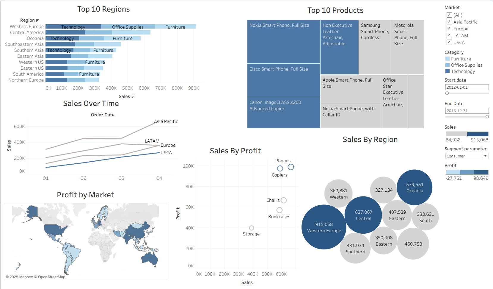

# Tableau Dashboard Project: Customer Churn Analysis  
 
 


**Prepared by:** Jose De Leon  
**Date:** June 21, 2025  

---

## 📊 Project Overview  
This project showcases the development of an interactive business intelligence dashboard in Tableau using the Superstore dataset. Designed with a focus on data storytelling and decision support, the dashboard empowers users to explore sales and profit performance across regions, products, and customer segments.  

Key features include:  
- Six dynamic visualizations (bar, line, bubble, scatter, treemap, and map).  
- Two date-range parameters with calculated fields for custom time filtering.  
- One list-based parameter for interactive segment analysis.  
- A unified dashboard that allows executives and analysts to adjust filters and instantly see results.  

This project demonstrates strong capabilities in Tableau, business intelligence, and interactive reporting. By integrating parameters and calculated fields, the dashboard goes beyond static visuals to deliver self-service analytics that support data-driven decision-making.  

---

## 📂 Project Files  
- [`Dashboard - Global Sales`](Dashboard%20-%20Global%20Sales%20-%20github.twbx)
- [`Dataset`](global_superstore_2016_cleaned.csv)
- [`Plots`](plots/)
- [`Project Tableau Dashboard PDF`](Project%20Tableau%20Dashboard%20github.pdf)
- [`LICENSE`](LICENSE)
- [`README.md`](README.md) 

---

## 📸 Dashboard Demonstration

[](https://public.tableau.com/views/Dashboard-GlobalSales-github/Dashboard?:language=en-US&:sid=&:redirect=auth&:display_count=n&:origin=viz_share_link)  

🔗 [View Full Dashboard on Tableau Public](https://public.tableau.com/views/Dashboard-GlobalSales-github/Dashboard?:language=en-US&:sid=&:redirect=auth&:display_count=n&:origin=viz_share_link)

Start Date: 01/01/2012

End Date: 12/31/2015

Segment Parameter: Consumer

---

## 🔍 Visualizations  

### 1. Top 10 Regions (Stacked Bar Chart)  
Filters: Region, Market, Category, Date Range, Segment  
  

### 2. Sales Over Time (Line Chart)  
Filters: Date Range, Market, Segment, Region  
  

### 3. Sales by Region (Bubble Plot)  
Filters: Date Range, Market, Segment, Region  
  

### 4. Sales by Profit (Scatter Plot)  
Filters: Date Range, Market, Region, Category, Segment  
  

### 5. Profit by Market (Map)  
Filters: Date Range, Market, Segment, Region  
  

### 6. Top 10 Products (Treemap)  
Filters: Date Range, Market, Segment, Region  
  
  

---

## ⏳ Parameters & Calculated Fields  

### Date Range Parameters  
- **Start Date Parameter**  
  Range: 01/01/2012 → 12/31/2015  
  Default: 12/16/2012  
    

- **End Date Parameter**  
  Range: 01/01/2012 → 12/31/2015  
  Default: 01/29/2014  
    

- **Date Range Filter (Calculated Field)**  
```tableau
IF [Order.Date] >= [Start date] AND [Order.Date] <= [End Date] THEN 1
ELSE 0
END
```

---

## 🛠 Tools Used

- Tableau Desktop (visualization & dashboard design)

- Superstore dataset (2016 cleaned version)

---


## ✅ Conclusion

This project highlights the ability to create dynamic, user-driven dashboards in Tableau. By combining multiple chart types with date and segment parameters, we built an interactive visualization tool that enables decision-makers to explore data from different perspectives.

The result is a professional dashboard that demonstrates business intelligence, interactivity, and data storytelling skills in Tableau, skills directly transferable to real-world analytics and reporting roles.

---

## 📚 References

- Tableau Software. (2024). Tableau Desktop: Visual Analytics. Retrieved from https://www.tableau.com/

- Tableau Help. (2024). Create Parameters. Retrieved from https://help.tableau.com/current/pro/desktop/en-us/parameters_create.htm

- Superstore Dataset. (n.d.). Sample data available in Tableau Desktop.

---

## 👤 Author  

**Jose De Leon**  
🎓 Master’s in Analytics Candidate, Northeastern University  
📬 [Email me](mailto:j.angel2294@gmail.com)  
🔗 [LinkedIn](https://www.linkedin.com/in/jose-de-leon-analytics/)

---
